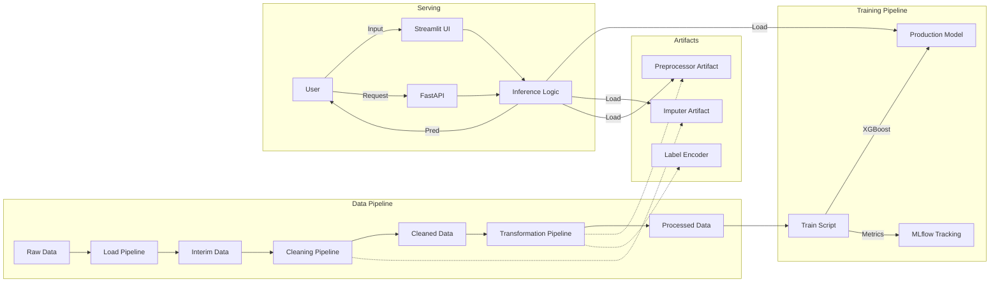

# 🔮 Customer Churn Prediction System

An End-to-End Machine Learning project to predict customer churn. This repository contains the full lifecycle: from modular data pipelines and experimentation to a production-ready FastAPI service and an interactive Streamlit UI, all containerized with Docker and verified via CI/CD.

 


---

## 🏛️ System Architecture

The project follows a modular pipeline architecture, separating concerns between Data Engineering, Model Training, and Serving.



---

## 🚀 Features

*   **Modular Pipelines**: Independent scripts for `load`, `clean`, `transform`, `tune`, `train`, and `eval`.
*   **Experiment Tracking**: Integrated with **MLflow** and **Optuna** for hyperparameter tuning.
*   **Production Serving**:
    *   **FastAPI**: High-performance REST API for real-time predictions.
    *   **Streamlit**: Interactive web dashboard for business users.
*   **Containerization**: Dockerfiles for both API and UI services.
*   **CI/CD**: GitHub Actions pipeline for automated testing and deployment to AWS ECR/ECS.
*   **Testing**: Comprehensive `pytest` suite including Unit, Integration, and End-to-End Smoke tests.

---

## 📂 Project Structure

```
├── .github/workflows   <- CI/CD Pipelines
├── data                <- Data directory (raw, interim, processed, predictions)
├── models              <- Saved models and artifacts (imputer, preprocessor)
├── src
│   ├── app             <- FastAPI Application
│   │   ├── api/v1      <- Router & Schemas
│   │   └── main.py     <- App Entrypoint
│   ├── app_ui          <- Streamlit Dashboard
│   ├── feature_pipeline<- ETL Scripts (load, clean, transform)
│   ├── training_pipeline<- Training Scripts (train, eval, tune)
│   └── inference_pipeline<- Inference Logic
├── tests               <- Test Suite
├── Dockerfile.api      <- API Container Config
├── Dockerfile.ui       <- UI Container Config
└── pyproject.toml      <- Dependencies (managed by uv)
```

---

## 🛠️ Getting Started

### Prerequisites
*   Python 3.11+
*   `uv` (Recommended package manager) or `pip`
*   Docker (Optional)

### Installation

1.  **Clone the repository**:
    ```bash
    git clone https://github.com/ahmudmuhamad/Customer-Churn-Prediction.git
    cd Customer-Churn-Prediction
    ```

2.  **Install Dependencies**:
    ```bash
    uv pip install --system -r pyproject.toml
    # OR
    pip install .
    ```

### 🏃‍♂️ Running the Pipelines

You can run individual pipeline stages manually:

```bash
# 1. Load Data
python src/feature_pipeline/load.py

# 2. Clean Data (Saves imputer artifact)
python src/feature_pipeline/clean.py

# 3. Transform Data (Saves preprocessor artifact)
python src/feature_pipeline/transform.py

# 4. Train Model (Saves model & logs to MLflow)
python src/training_pipeline/train.py

# 5. Evaluate
python src/training_pipeline/eval.py
```

### 🌩️ Running the API

Start the FastAPI server locally:

```bash
make run-api
# OR
uvicorn src.app.main:app --reload
```

*   **Docs**: `http://127.0.0.1:8000/docs`
*   **Endpoint**: `POST /api/v1/predict` (See Swagger UI for payload example)

### 📊 Running the Dashboard

Launch the Streamlit Interface:

```bash
make run-ui
# OR
streamlit run src/app_ui/home.py
```

---

## 🐳 Docker

Build and run the services using Docker:

### API Service
```bash
docker build -f Dockerfile.api -t churn-api .
docker run -p 8000:8000 churn-api
```

### Streamlit UI
```bash
docker build -f Dockerfile.ui -t churn-ui .
docker run -p 8501:8501 churn-ui
```

---

## ✅ Testing

Run the test suite to ensure system stability:

```bash
# Run all tests
pytest tests/

# Run End-to-End Smoke Test
pytest tests/test_smoke.py
```

---

## 📄 License

This project is licensed under the MIT License - see the [LICENSE](LICENSE) file for details.
